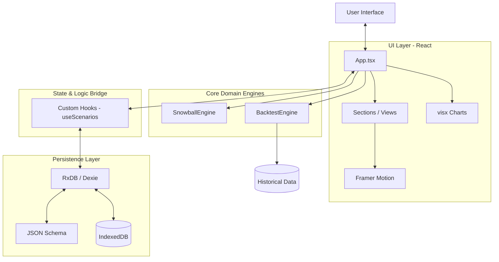

<!-- generated-by: gsd-doc-writer -->
# Architecture

**Analysis Date:** 2026-05-15

## System Overview

Stock Snowball is a local-first, Apple-inspired investment simulation platform. It enables users to visualize the "snowball effect" of long-term investing through two primary modes: **Future Projection** and **Historical Backtesting**. 

The system architectural style is a **Layered Local-First Web App**. It prioritizes client-side performance and privacy by performing all calculations and data storage directly in the user's browser. High-precision financial math is guaranteed through the use of `Decimal.js`, while a premium user experience is delivered via Framer Motion and glassmorphic UI design.

## Component Diagram

## Data Flow

### 1. Real-time Simulation Flow
1. **Input**: User adjusts a parameter (e.g., monthly contribution, expected return) in the UI.
2. **State Update**: React state updates, triggering a recalculation via `useMemo`.
3. **Calculation**: The relevant engine (`SnowballEngine` for projections or `BacktestEngine` for historical data) executes synchronously.
4. **Visualization**: The resulting dataset is passed to `visx` chart components and `AnimatedCounter` KPI cards for immediate visual feedback.

### 2. Reactive Persistence Flow
1. **Action**: User saves or deletes a scenario.
2. **Hook Execution**: `useScenarios` hook calls the RxDB collection methods.
3. **Reactive Update**: RxDB's observable stream detects the change in the local IndexedDB.
4. **UI Sync**: The hook receives the updated list of scenarios and updates React state, causing a smooth UI transition.

### 3. Share Card Generation (CORS Strategy)
1. **Trigger**: User clicks "Share Performance" in the KPI Grid.
2. **Capture**: `html-to-image` is used to capture an off-screen `ShareCard` component.
3. **Security Fix**: To prevent `SecurityError` (CORS) when rendering the canvas with external resources:
    - `skipFonts: true` is applied to avoid cross-origin font fetching issues.
    - `cacheBust: true` ensures the latest assets are used without stale cache interference.
    - Backgrounds are rendered using CSS gradients rather than external images where possible.

## Key Abstractions

| Abstraction | Purpose | Location |
|-------------|---------|----------|
| **SnowballEngine** | Stateless utility for future projections. Handles compound interest, inflation-adjusted values, and bankers rounding. | `src/core/SnowballEngine.ts` |
| **BacktestEngine** | Logic for historical simulations using real market indices. Calculates CAGR, MDD, and dividend reinvestment logic. | `src/core/BacktestEngine.ts` |
| **RxDB Collection** | Schema-validated, reactive local storage layer. Abstracts away the complexity of native IndexedDB. | `src/db/database.ts` |
| **Motion UI** | Spring-based animation system using `framer-motion` for physical-feeling transitions (scale-down, layout transitions). | `src/App.tsx`, `src/components/common/AnimatedCounter.tsx` |
| **Glassmorphism** | UI style using `backdrop-blur` and semi-translucent surfaces to create depth and hierarchy (frosted glass effect). | `src/components/layout/GlobalNav.tsx`, `src/components/sections/KPIGrid.tsx` |

## Directory Structure Rationale

- **`src/core/`**: The "brain" of the application. Contains pure TypeScript logic for financial calculations. Completely independent of the UI framework.
- **`src/db/`**: Database configuration and schema definitions. Centralizes the persistence logic.
- **`src/hooks/`**: React-specific bridges between the database and the UI.
- **`src/components/`**: Atomic and molecular UI components.
    - `charts/`: Data visualizations using `visx`.
    - `sections/`: High-level UI blocks (e.g., `BacktestView`, `KPIGrid`).
    - `layout/`: Global structural components like navigation.
- **`src/data/`**: Static historical market data (JSON) and asset metadata.
- **`src/types/`**: Shared TypeScript interfaces for financial models and application state.

## Architectural Constraints

- **Math Precision**: Native JavaScript `Number` is strictly prohibited for financial calculations. `Decimal.js` must be used to prevent floating-point compounding errors.
- **Privacy First**: No user-identifiable data or financial scenario data should ever leave the client-side environment (except for explicit image sharing by the user).
- **Offline Capability**: The application must be fully functional as a PWA, relying only on local data and indices.

---

*Architecture analysis: 2026-05-15 (Post Phase 12)*
