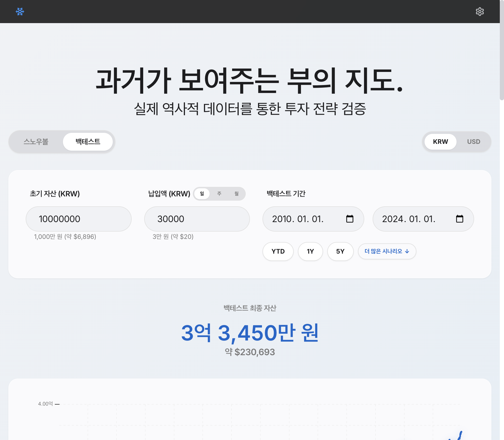
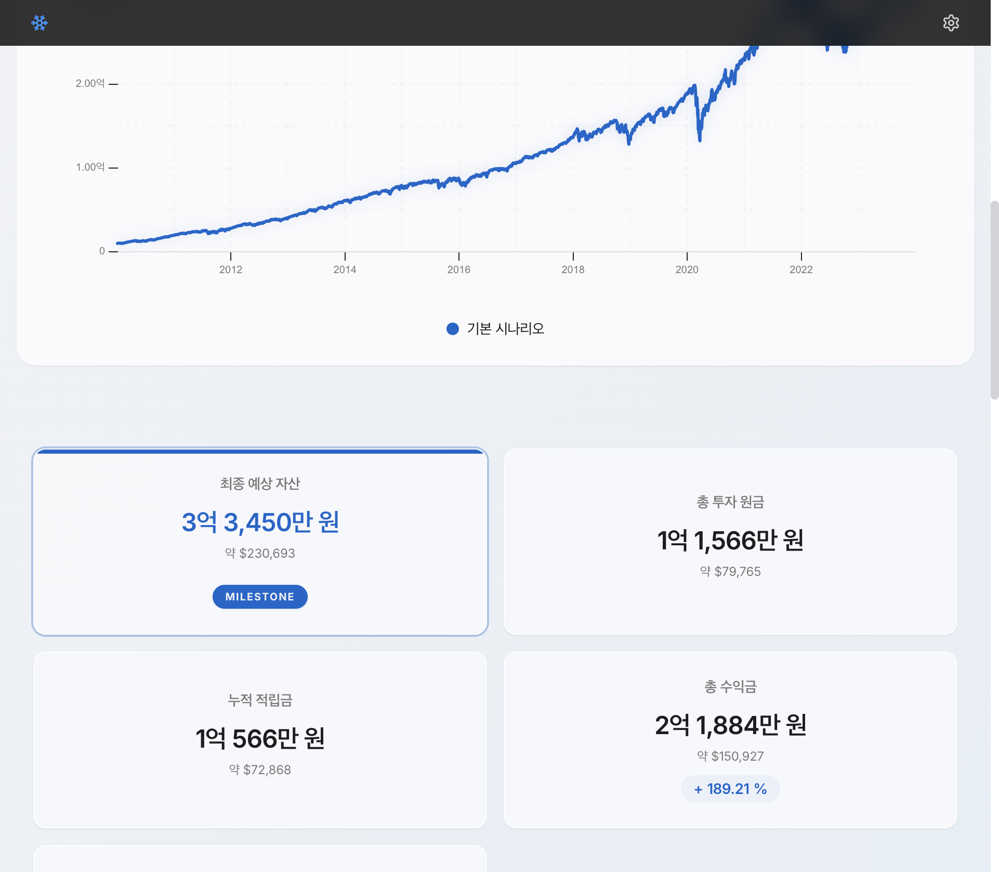
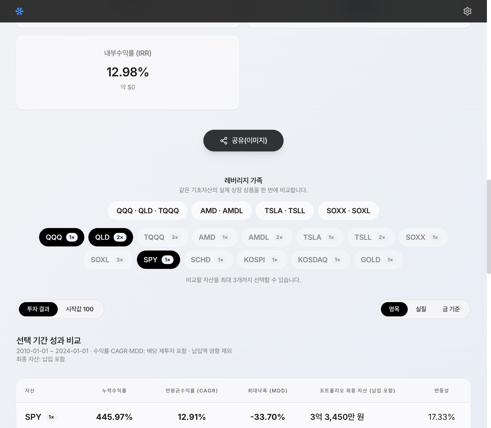
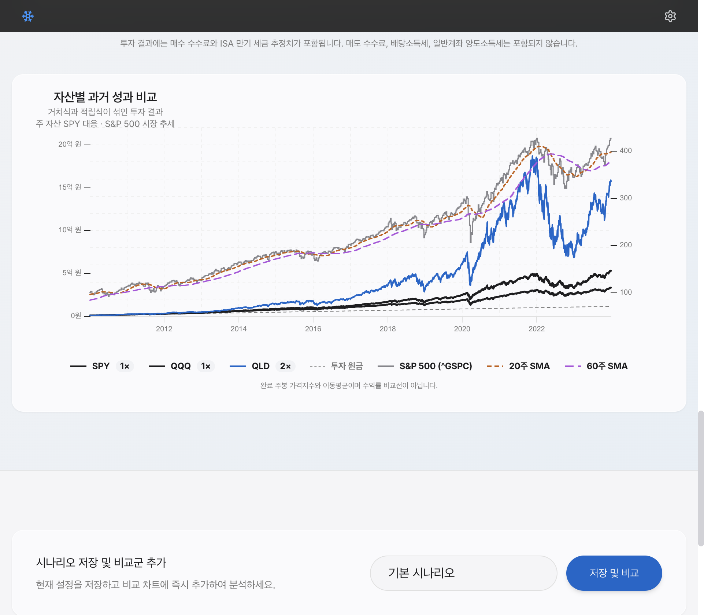
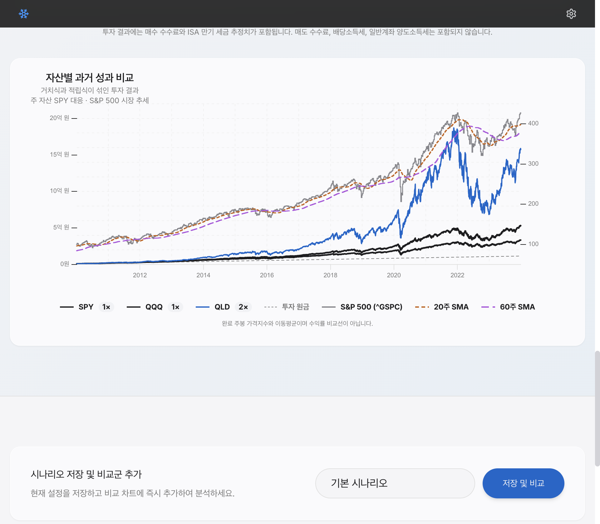

# Backtest Page Design Audit and Target State

## Decision

The backtest page will keep the final asset amount as the standalone headline. The four primary metrics immediately below it will be:

1. `누적수익률`
2. `연평균수익률 (CAGR)`
3. `최대낙폭 (MDD)`
4. `투자원금`

The backtest experience remains the detailed analysis surface. Asset selection, value-basis controls, result-view controls, the performance table, market-trend context, leverage insights, calculation errors, sharing, and saved-scenario comparison must remain available.

Only one chart should be visible at a time. The detailed asset chart is the default; saved-scenario comparison uses the same chart slot rather than adding another chart to the page.

## Audit Scope

- Product: Stock Snowball
- Surface: desktop backtest page
- User goal: choose a period and assets, understand return and risk, compare products, and inspect nominal, real, or gold-relative outcomes without losing the selected period
- Capture tool: Orca in-app browser
- Captured viewport: 961 × 838 CSS pixels at device pixel ratio 2
- Captured state: 2010-01-01 through 2024-01-01, KRW, daily contribution, SPY followed by SPY/QQQ/QLD comparison
- Console: no browser-console messages during the captured flow

## Current Flow

### Step 1 — Set the backtest inputs

**Health: Good**

The top of the page clearly separates projection and backtest modes. Initial capital, contribution, contribution frequency, and the date range are visible together. The final asset amount is already prominent and should remain here.

### Step 2 — Read the first chart and legacy KPI grid

**Health: Needs restructuring**

The first chart consumes almost one viewport and only shows the active scenario. The five-card grid repeats the final asset amount and emphasizes portfolio cash-flow metrics before the user reaches return and risk analysis. In backtest mode this delays the primary questions: how much did the product return, how consistently did it compound, and how far did it fall?

### Step 3 — Select comparison assets and read performance

**Health: Useful but too far down the page**

The comparison area contains the information the user expects from a backtest: family selection, individual assets, cumulative return, CAGR, MDD, final portfolio value, and volatility. It appears only after the first chart, five KPI cards, and the share action.

The current all-assets button wall is visually dense. Family shortcuts are useful and should stay visible; individual assets should move into a collapsed disclosure that shows selected chips when closed.

### Step 4 — Inspect the detailed comparison chart

**Health: Functionally strong, visually overloaded**

The detailed chart supports multiple assets, invested principal, the representative market index, and two moving averages. With three assets selected, up to seven lines compete for attention. Market-trend context and moving averages remain part of detailed analysis, but should be an explicit secondary overlay that is off by default.

### Step 5 — Change the value basis

**Health: Calculation state works; context is easy to lose**

Switching to real value preserved the selected 2010-01-01 through 2024-01-01 period and rendered the adjusted chart without console errors. Once the user scrolls to the chart, however, the selected `명목 / 실질 / 금 기준` state is outside the viewport. The current value basis must stay visible in the chart header and in the primary-metric heading.

## Strengths to Preserve

- The final backtest asset amount is clear and visually prominent.
- The selected period remained stable while adding QQQ and QLD and while switching to real value.
- Product metrics are already separated from contribution-inclusive portfolio value in the detailed table.
- The detailed chart has an accessible name and a keyboard-operable date slider.
- Result view and value basis are exposed as labeled semantic button groups.
- Calculation failures can be shown per asset without blocking successful assets.

## Main Risks

### Structural

- Two full-width charts answer overlapping growth questions and create unnecessary scrolling.
- The legacy KPI grid repeats the final asset and foregrounds IRR while cumulative return, CAGR, and MDD are delayed.
- Removing the first chart without a replacement path would also remove saved-scenario comparison, because that chart currently owns it.

### Visual

- Fourteen individual asset buttons compete with four family shortcuts.
- The detailed chart becomes difficult to parse when asset lines, principal, market index, SMA20, and SMA60 are all visible.
- Large vertical gaps between the KPI area, comparison controls, chart, and scenario section make the page feel longer than its information content requires.

### Accessibility

- The first SVG chart has no accessible chart name or keyboard date exploration, while the detailed chart already provides both.
- Color alone should not communicate selected versus unavailable assets; pressed state, disabled reason, and visible text must remain.
- Screenshot inspection cannot confirm complete keyboard order, focus visibility in every state, screen-reader announcements after asynchronous calculation, or reflow at 200% zoom.

## Target Information Architecture

1. Backtest inputs and date range
2. Standalone `백테스트 최종 자산` headline
3. Primary metric strip: `누적수익률 / CAGR / MDD / 투자원금`
4. Detailed-analysis controls
   - leverage-family shortcuts
   - selected asset chips
   - collapsed individual-asset picker
   - `투자 결과 / 시작값 100`
   - `명목 / 실질 / 금 기준`
5. One chart slot
   - default: detailed asset comparison
   - optional: saved-scenario comparison when saved comparisons exist
   - optional secondary overlay: market index, SMA20, SMA60
6. Selected-period performance table
7. Leverage insights and per-asset calculation errors
8. Share action
9. Scenario save and saved scenarios

## Metric Contract

The primary strip describes the selected primary product and selected value basis.

| Metric | Source | Cash contributions | Value-basis behavior |
| --- | --- | --- | --- |
| 누적수익률 | `prepared primary result.productMetrics.cumulativeReturn` | Excluded | Recomputed from nominal, real, or gold-relative product series |
| CAGR | `prepared primary result.productMetrics.cagr` | Excluded | Recomputed from the selected value-basis product series |
| MDD | `prepared primary result.productMetrics.mdd` | Excluded | Recomputed from the selected value-basis product series |
| 투자원금 | final `prepared primary result.portfolioHistory[].principal` | Included | Uses the same selected value basis as the chart |

The standalone headline continues to show the final contribution-inclusive, after-tax portfolio value. IRR remains available in detailed analysis or explanatory content, but it does not occupy one of the four primary metric slots because it answers a different cash-flow-weighted question than product CAGR.

## Chart Contract

- Backtest mode mounts one visible chart at a time.
- The detailed asset comparison is the default chart.
- `시장 추세` is off by default. Enabling it adds the representative index, SMA20, and SMA60 with the existing disclosure and accessible tooltip values.
- When one or more saved scenarios are selected for comparison, the chart header exposes `종목 상세 / 저장 시나리오 비교`. Switching the control replaces the chart in the same slot.
- Projection mode retains its existing Snowball chart and legacy KPI grid.
- Value basis and result view remain visible adjacent to the chart header.
- Changing assets, chart view, market overlay, or value basis must not reset the selected date range unless the requested range lies outside common data coverage. Any coverage correction remains explicit through the existing range notice.

## Acceptance Criteria

- Backtest mode shows one chart; projection mode remains unchanged.
- The final asset amount appears once as the headline and not again in the primary metric strip.
- The four primary metrics are visible before the chart without scrolling past a legacy KPI grid.
- All current detailed backtest analysis remains reachable.
- Saved backtest scenario comparison remains available without creating a second simultaneous chart.
- Market-trend lines are hidden by default and can be restored with one labeled control.
- The selected value basis is visible in the metric and chart context.
- Family and individual asset selection preserve the requested dates when coverage permits.
- The default desktop and mobile layouts have no horizontal overflow.
- The detailed chart remains keyboard explorable and its accessible name reflects the active chart mode and market-overlay state.

## Evidence Limits

This report is based on one current desktop browser run. It does not claim complete WCAG compliance or visual approval for mobile breakpoints. Playwright coverage and a final Orca browser pass are required after implementation.
